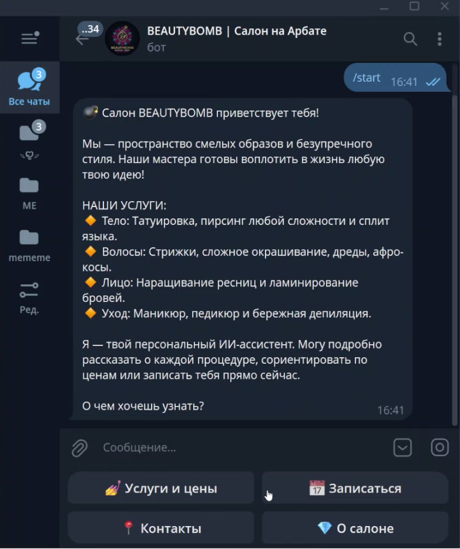
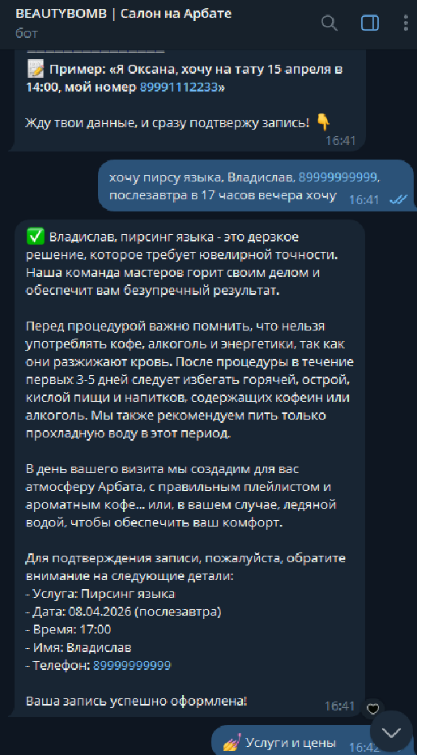
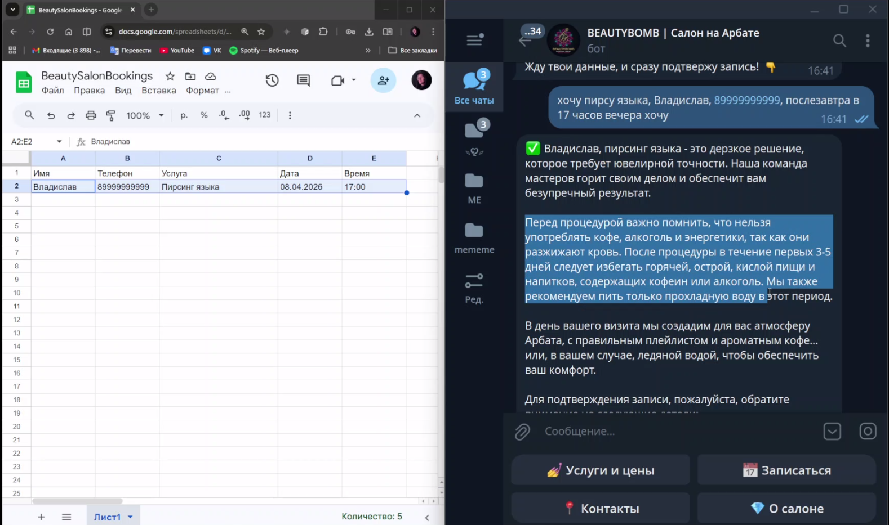

# 💣 BeautyBomb AI — Telegram-бот для бьюти-коворкинга

Телеграм-бот – ИИ-ассистент премиального салона BEAUTYBOMB. Консультирует, показывает услуги, автоматически записывает клиентов в Google Sheets с проверкой дубликатов.

## Основные функции
- 🤖 Естественное общение через Groq (Llama 3.3 70B)
- 💅 Встроенный прайс-лист и описание процедур
- 📅 Умная онлайн-запись с валидацией данных
- 📊 Сохранение всех обращений в Google Таблицу
- ⚡ Высокая скорость ответа (Aiogram 3.x, asyncio)

## Технологический стек
`Python 3.12` `Aiogram 3.13` `Groq API` `gspread` `python-dotenv`

## Быстрый старт
1. Клонируйте репозиторий:  
   `git clone https://github.com/eliyus-ai-dev/beautybomb-ai-bot.git`
2. Установите зависимости: `pip install -r requirements.txt`
3. Получите токены:
   - Создайте бота в [@BotFather](https://t.me/BotFather) и получите BOT_TOKEN.
   - Зарегистрируйтесь на [Groq Cloud](https://console.groq.com), создайте API-ключ.
   - Создайте сервисный аккаунт Google Cloud, скачайте JSON-ключ (`credentials.json`) и настройте доступ к Google Sheets.
4. Создайте файл `.env` на основе `.env.example` и заполните все переменные.
5. Запустите бота: `python main.py`

## Демонстрация

## Контакты
Разработчик: [@eliyusvl]  
Email: overmuf24@gmail.com